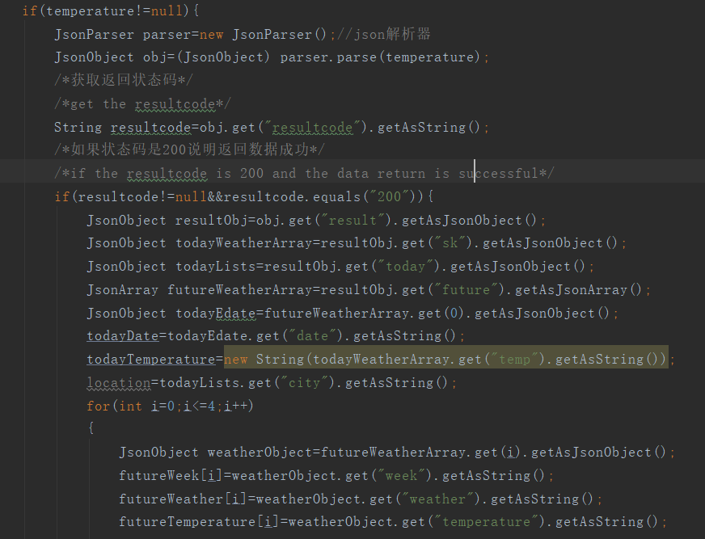

# Weather forecast application

The display gif demo:

运行效果gif如下所示：


And the design of the application is as follows:

这是整体界面设计图：


When the button is pressed, the weather will be updated to the latest and the toast will inform the user.
当按钮被按下时，界面的天气情况都会被更新，并且toast显示消息在界面上告知用户天气已更新：


As the project is updated based on the project of dragona and added some functions, I will explain how to implement the update about the update part.
If we need to specify what we will be doing, here is the list:
该应用是在原有项目的基础上添加了部分功能实现的，我在这里主要说明一下我所更新得部分得实现。

I have not change the main design of UI and what I only do is to add TextViews below the icons to show the temperatures of the next four days.

对于整体界面我没有做任何改动，仅仅是在图标的下面添加了TextView来展示接下来四天的温度。


To check whether everything is working properly, I always run my application for testing on my virtual devices.

为了保证一切正常，设计完毕后，我在虚拟机上进行了测试：

My AVD specication is: 

我使用的虚拟设备规格如下: 

- Device name (设备名): Custom Phone of Genymotion
- Height (高度): 1280
- Width (宽度): 720
- API level (API等级): 28

I will do most of the design work in the 'activity_main.xml' which is located inside the 'res/layout' folder. Currently, below is what I have updated.

我们的设计工作将会主要在'activity_main.xml'文件中完整，该文件位于res/layout'文件夹。我修改的内容如下所示：


```xml
<LinearLayout
        android:layout_width="match_parent"
        android:layout_height="0dp"
        android:layout_weight="2"
        android:background="@android:color/white"
        android:orientation="horizontal"
        android:weightSum="4"
        tools:layout_editor_absoluteX="8dp"
        tools:layout_editor_absoluteY="380dp">

        <LinearLayout
            android:layout_width="0dp"
            android:layout_height="wrap_content"
            android:layout_weight="1"
            android:gravity="center"
            android:orientation="vertical">

            <ImageView
                android:id="@+id/image1"
                android:layout_width="48dp"
                android:layout_height="48dp"
                app:srcCompat="@drawable/rainy_small" />

            <TextView
                android:id="@+id/week1"
                android:layout_width="match_parent"
                android:layout_height="wrap_content"
                android:gravity="center"
                android:text="mon"
                android:textAllCaps="true"
                android:textColor="#909090" />
            <TextView
                android:id="@+id/temperature1"
                android:layout_width="match_parent"
                android:layout_height="wrap_content"
                android:textAllCaps="true"
                android:text="10℃"
                android:textColor="#909090"
                android:gravity="center"
                />
        </LinearLayout>

        <LinearLayout
            android:layout_width="0dp"
            android:layout_height="wrap_content"
            android:layout_weight="1"
            android:gravity="center"
            android:orientation="vertical">

            <ImageView
                android:id="@+id/image2"
                android:layout_width="48dp"
                android:layout_height="48dp"
                app:srcCompat="@drawable/partly_sunny_small" />

            <TextView
                android:id="@+id/week2"
                android:layout_width="match_parent"
                android:layout_height="wrap_content"
                android:gravity="center"
                android:text="tue"
                android:textAllCaps="true"
                android:textColor="#909090" />
            <TextView
                android:id="@+id/temperature2"
                android:layout_width="match_parent"
                android:layout_height="wrap_content"
                android:textAllCaps="true"
                android:text="10℃"
                android:textColor="#909090"
                android:gravity="center"
                />
        </LinearLayout>

        <LinearLayout
            android:layout_width="0dp"
            android:layout_height="wrap_content"
            android:layout_weight="1"
            android:gravity="center"
            android:orientation="vertical">

            <ImageView
                android:id="@+id/image3"
                android:layout_width="48dp"
                android:layout_height="48dp"
                app:srcCompat="@drawable/windy_small" />

            <TextView
                android:id="@+id/week3"
                android:layout_width="match_parent"
                android:layout_height="wrap_content"
                android:gravity="center"
                android:text="thu"
                android:textAllCaps="true"
                android:textColor="#909090" />
            <TextView
                android:id="@+id/temperature3"
                android:layout_width="match_parent"
                android:layout_height="wrap_content"
                android:textAllCaps="true"
                android:text="10℃"
                android:textColor="#909090"
                android:gravity="center"
                />
        </LinearLayout>

        <LinearLayout
            android:layout_width="0dp"
            android:layout_height="wrap_content"
            android:layout_weight="1"
            android:gravity="center"
            android:orientation="vertical">

            <ImageView
                android:id="@+id/image4"
                android:layout_width="48dp"
                android:layout_height="48dp"
                app:srcCompat="@drawable/sunny_small" />

            <TextView
                android:id="@+id/week4"
                android:layout_width="match_parent"
                android:layout_height="wrap_content"
                android:gravity="center"
                android:text="fri"
                android:textAllCaps="true"
                android:textColor="#909090" />
            <TextView
                android:id="@+id/temperature4"
                android:layout_width="match_parent"
                android:layout_height="wrap_content"
                android:textAllCaps="true"
                android:text="10℃"
                android:textColor="#909090"
                android:gravity="center"
                />
        </LinearLayout>
    </LinearLayout>

```

First we need to put the privilege request in the AndroidManifest.xml. Hence we could get access to the Internet.

首先我们只需要简单明了的把应用需要连接网络的权限请求放在AndroidManifest文件即可,这样我们才能进行网络访问。

```xml
    <uses-permission android:name="android.permission.INTERNET"/>

```

As the Get request has been completed and what I have done in MainActivity.java is as follows:

因为Get向地址请求数据的部分已经写好，我在java代码中添加的部分包含以下内容：

To get the data stablely I choose an API ofweather information in China:https://www.juhe.cn/docs/api/id/39 which is free and stable.

为了获得稳定的数据访问，我选择了一个中国的天气预报API，它的使用是免费的且网络访问稳定。

This is the json file:

这是获取的json文件：


Based on the format of data and city, the URL is :

基于获取数据的格式和所选择的城市，URL地址为：

"http://v.juhe.cn/weather/index?cityname=%E9%87%8D%E5%BA%86&dtype=json&format=2&key=bd318ae49ffa63d1b02977e8862d82e0"


At the beginning we need to declare some arraies and variables to store the data:

在开始的地方我们需要声明一些数组和变量来存储数据：


Then is the most important part is to analyze the json format file and store the data which we need in arraies and variable to be convenient used later。

然后是最重要的部分对json文件进行解析，把我们需要的数据提取并储存在变量和数组中以便接下来使用。



Because the API is Chinese, I also need to transfer it into English and display them below the icons.

由于是中国的网站的API，我还要把一周的星期几转换为英文显示在界面上。


根据不同的天气情况需要在屏幕的下方显示接下来四天的天气图标，所以我对不同的天气对应上不同的图标。

As we need to display icons sccoding to different weathers in next four days, I match various weathers with different icons.


在UI主线程中，在相应的位置对日期，星期，地址，温度和图片进行界面更新：

In the UI thread, the date, week, address, temperatures and icons are updated.


When users click the button- “Update The Weather”, the weathers will be updated to the latest and the toast will inform the user it. And whhat I do is to add two lines of codes in the btnClick function:

当用户点击按钮“Update The Weather”时，天气情况会更新到最新情况. 然后会发送一个toast消息来让告知用户界面已更新。我再btnClick函数里加了两行来代码来实现了此功能：


